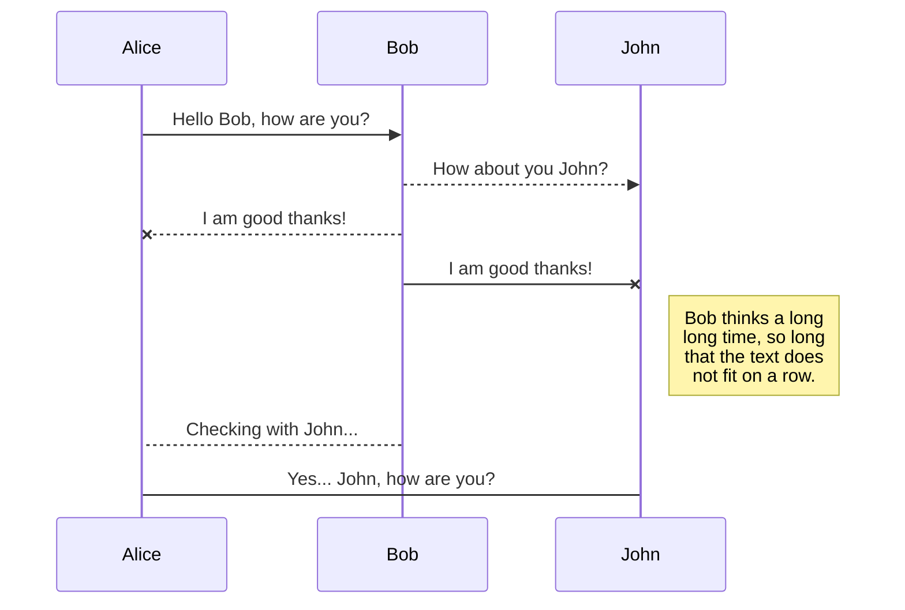
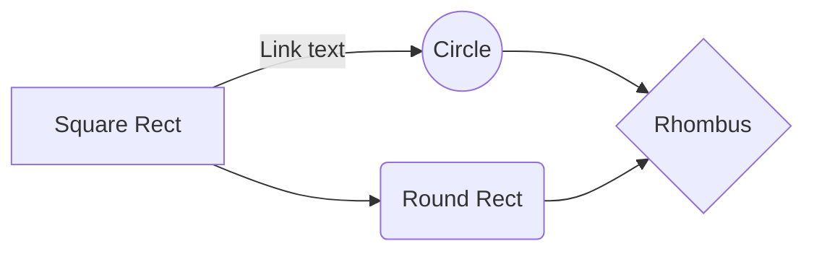

# THRIVE

***One stop solution for students for college activities***

Since the second wave of Covid-19 is resurfacing, we need to think twice before interacting with someone. The colleges have been shut down and the student interactions with their peers and seniors have been hampereed. This has also posted a problem effective study material and assignment managements.

***This portal servers as a solution to the problems***

<!-- The portal enables students to discover the students in the college who share common interests, post projects open for collaboration and ask questions about college. 
It also has a classroom management system where teachers and students activities can be managed, teachers can post, study materials and assignments,which the students can submit before given deadlines. Classroom also has the facility to chat in realtime. -->

**THRIVE**  is a one stop solution for having eve efficient online education to quality student life. We provide solutions to classroom management, improving student interactions, project collaborations, college activities and many more. The portal allows both students and faculty to manage their activities.

The main aim of the portal is to provide an easy-to-use all-in-one solution for dealing all activities associated with any educational institution online without any limitations.

## Technologies used

- **NodeJs** - evented I/O for the backend
- **Express** - fast node.js network app framework
- **Socket.io** - Package used to create realtime chats.
- **MongoDB** - NoSQL Database
- **React.js** - Javascript llibrary to build user frameworks.
- **GoogleOAuth** - Open Authorization from Google
- **MaterialUI** - React components based on Material Design.

# Pages

**Login Page**

 
 

**User Profile**: Show and edit the information of the user. Students can view profiles of their peers.

**Editing Profile**:

 

**Discover Feature**: 
 
A directory of students in college which supports search based on name, email, skills, positions of responsibilities, student activities and, of course, branch and year.

Search by tags: 

**Projects Panel**: 
The panel is a platform for students to post their projects and ask for collaborators. 

Project details include basic details like title, description along tags and present collaborators. 
Thus it provides a list of projects avialable in the college, to which students can request to join. Owners can approve or reject the requests. 
Projects are equipped with tags to enhance filtering and sending notifications to students with the tags.
 
Admin has option to blacklist the project to prevent unnecessary spamming. 

**Discussion**: A forum where students can ask questions to each other and their seniors. The forum also allows anonymous questions and answers to allow free expression of views.

The admins have the authority to blacklist projects and questions to prevent unnecessary spamming.

# Motivation

# Files

StackEdit stores your files in your browser, which means all your files are automatically saved locally and are accessible **offline!**

## Create files and folders

The file explorer is accessible using the button in left corner of the navigation bar. You can create a new file by clicking the **New file** button in the file explorer. You can also create folders by clicking the **New folder** button.

## Switch to another file

All your files and folders are presented as a tree in the file explorer. You can switch from one to another by clicking a file in the tree.

## Rename a file

You can rename the current file by clicking the file name in the navigation bar or by clicking the **Rename** button in the file explorer.

## Delete a file

You can delete the current file by clicking the **Remove** button in the file explorer. The file will be moved into the **Trash** folder and automatically deleted after 7 days of inactivity.

## Export a file

You can export the current file by clicking **Export to disk** in the menu. You can choose to export the file as plain Markdown, as HTML using a Handlebars template or as a PDF.

# Synchronization

Synchronization is one of the biggest features of StackEdit. It enables you to synchronize any file in your workspace with other files stored in your **Google Drive**, your **Dropbox** and your **GitHub** accounts. This allows you to keep writing on other devices, collaborate with people you share the file with, integrate easily into your workflow... The synchronization mechanism takes place every minute in the background, downloading, merging, and uploading file modifications.

There are two types of synchronization and they can complement each other:

- The workspace synchronization will sync all your files, folders and settings automatically. This will allow you to fetch your workspace on any other device.
	> To start syncing your workspace, just sign in with Google in the menu.

- The file synchronization will keep one file of the workspace synced with one or multiple files in **Google Drive**, **Dropbox** or **GitHub**.
	> Before starting to sync files, you must link an account in the **Synchronize** sub-menu.

## Open a file

You can open a file from **Google Drive**, **Dropbox** or **GitHub** by opening the **Synchronize** sub-menu and clicking **Open from**. Once opened in the workspace, any modification in the file will be automatically synced.

## Save a file

You can save any file of the workspace to **Google Drive**, **Dropbox** or **GitHub** by opening the **Synchronize** sub-menu and clicking **Save on**. Even if a file in the workspace is already synced, you can save it to another location. StackEdit can sync one file with multiple locations and accounts.

## Synchronize a file

Once your file is linked to a synchronized location, StackEdit will periodically synchronize it by downloading/uploading any modification. A merge will be performed if necessary and conflicts will be resolved.

If you just have modified your file and you want to force syncing, click the **Synchronize now** button in the navigation bar.

> **Note:** The **Synchronize now** button is disabled if you have no file to synchronize.

## Manage file synchronization

Since one file can be synced with multiple locations, you can list and manage synchronized locations by clicking **File synchronization** in the **Synchronize** sub-menu. This allows you to list and remove synchronized locations that are linked to your file.

# Publication

Publishing in StackEdit makes it simple for you to publish online your files. Once you're happy with a file, you can publish it to different hosting platforms like **Blogger**, **Dropbox**, **Gist**, **GitHub**, **Google Drive**, **WordPress** and **Zendesk**. With [Handlebars templates](http://handlebarsjs.com/), you have full control over what you export.

> Before starting to publish, you must link an account in the **Publish** sub-menu.

## Publish a File

You can publish your file by opening the **Publish** sub-menu and by clicking **Publish to**. For some locations, you can choose between the following formats:

- Markdown: publish the Markdown text on a website that can interpret it (**GitHub** for instance),
- HTML: publish the file converted to HTML via a Handlebars template (on a blog for example).

## Update a publication

After publishing, StackEdit keeps your file linked to that publication which makes it easy for you to re-publish it. Once you have modified your file and you want to update your publication, click on the **Publish now** button in the navigation bar.

> **Note:** The **Publish now** button is disabled if your file has not been published yet.

## Manage file publication

Since one file can be published to multiple locations, you can list and manage publish locations by clicking **File publication** in the **Publish** sub-menu. This allows you to list and remove publication locations that are linked to your file.

## Contributors

- **[Navaneeth Bysani](https://www.linkedin.com/in/navaneeth-bysani-639b4219a/)**
- **[P Kartikeya](https://www.linkedin.com/in/kartikeya-pochampalli-29a0a319b/)**
- **[Sai Krishna Jupally](https://www.linkedin.com/in/sai-krishna-jupally-b7050177/)**
- **[Shrirang Deshmukh](https://www.linkedin.com/in/shrirang-deshmukh/)**

> **ProTip:** You can disable any **Markdown extension** in the **File properties** dialog.

## SmartyPants

SmartyPants converts ASCII punctuation characters into "smart" typographic punctuation HTML entities. For example:

|                |ASCII                          |HTML                         |
|----------------|-------------------------------|-----------------------------|
|Single backticks|`'Isn't this fun?'`            |'Isn't this fun?'            |
|Quotes          |`"Isn't this fun?"`            |"Isn't this fun?"            |
|Dashes          |`-- is en-dash, --- is em-dash`|-- is en-dash, --- is em-dash|

## KaTeX

You can render LaTeX mathematical expressions using [KaTeX](https://khan.github.io/KaTeX/):

The *Gamma function* satisfying $\Gamma(n) = (n-1)!\quad\forall n\in\mathbb N$ is via the Euler integral

$$
\Gamma(z) = \int_0^\infty t^{z-1}e^{-t}dt\,.
$$

> You can find more information about **LaTeX** mathematical expressions [here](http://meta.math.stackexchange.com/questions/5020/mathjax-basic-tutorial-and-quick-reference).

## UML diagrams

You can render UML diagrams using [Mermaid](https://mermaidjs.github.io/). For example, this will produce a sequence diagram:

And this will produce a flow chart:

